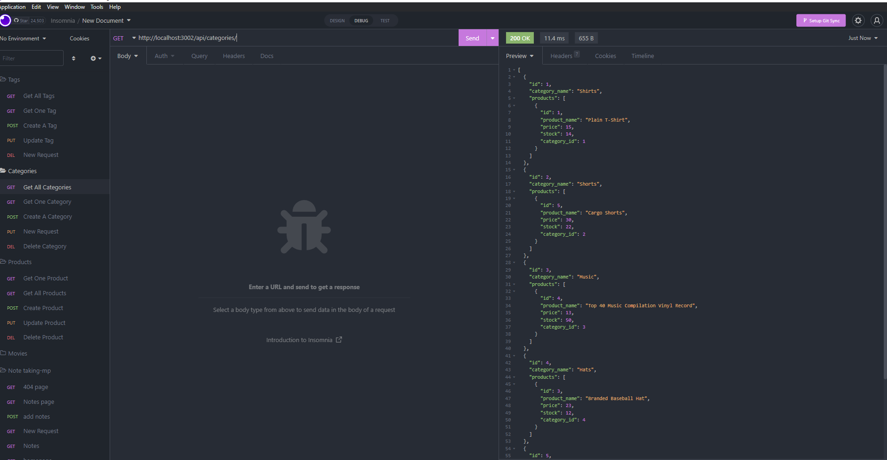

# E-commerce

## Description 
In this app, it uses sequelize and SQL to create a database for an e-commerce store. The sequelize package helps us create the SQL tables for our data to sit in. Within the model 
When the tables are created we seed the data given. Also in the models we created, we have foreign keys to connect our tables to each other, "belongsToMany" and "hasMany" were used to connect the products, tags, and categories to each other. Once everything is connected and the seed is placed we have routes for the categories, prodcuts, and tags. All three of these routes have a get all, get single id, create new, update an id, and delete id.

## User Story 
AS A manager at an internet retail company 
I WANT a back end for my e-commerce website that uses the latest technologies 
SO THAT my company can compete with other e-commerce comp 

## Acceptance Criteria 
GIVEN a functional Express.js API 
WHEN I add my database name, MySQL username, and MySQL password to an environment variable file 
THEN I am able to connect to a database using Sequelize 
WHEN I enter schema and seed commands 
THEN a development database is created and is seeded with test data 
WHEN I enter the command to invoke the application 
THEN my server is started and the Sequelize models are synced to the MySQL database 
WHEN I open API GET routes in Insomnia Core for categories, products, or tags 
THEN the data for each of these routes is displayed in a formatted JSON 
WHEN I test API POST, PUT, and DELETE routes in Insomnia Core 
THEN I am able to successfully create, update, and delete data in my database 

## Installation
npm i sequelize 
npm i mysql2 
npm i express 
npm i dotenv 
npm i nodemon 

## Usage
The mysql2 package helps with bringing the data base from SQL to your javascript file. Sequelize lets you model the tables to be created in SQL from the javascript file. Express will allow you to host your local server to test the routes. The dotenv allows you to encrypt your password, username, and data_base. Just be sure to create a ".env" file to put your encryptions. Also, make sure the names match with the connection.js file. Nodemon isn't a required package but it restarts your server every time you run it so you won't have to keep "node server.js".
## ScreenShot
Example of the All Products route

## Link
https://www.youtube.com/watch?v=PnQZUCG7kdE

## Questions 
Message me at these links for further questions.

https://github.com/Jonnvoo 
Jonathanvu2065@gmail.com

